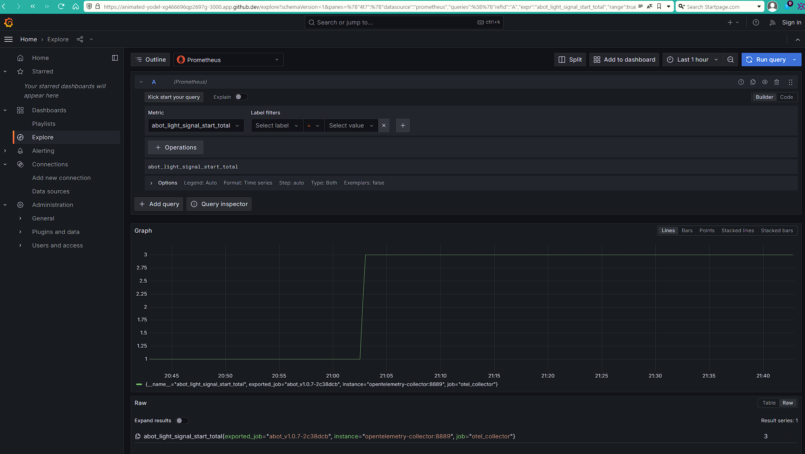

# abot

# Monitoring Abot за допомогою OpenTelemetry + Grafana + Loki + Prometheus розгорнуто за допомогою Flux

Усі API-компонентів оновлені до останнього рівня на 23.05.2024р.

Встановлюємо terraform, flux
(розгортання виконувалось у KIND)

```shell
terraform init
terraform validate
terraform plan
terraform apply
```

Коли буде розгорнуто репо, клонуємо
```shell
git clone <repo/flux-gitops>
```

Переходимо до директорії
```shell
cd flux-gitops
```

Створюємо такі директорії:
```shell
mkdir flux-gitops/kind/dev
mkdir flux-gitops/kind/dev/abot
mkdir flux-gitops/kind/dev/mon
mkdir flux-gitops/kind/monitoring/cert-manager
mkdir flux-gitops/kind/monitoring/prometheus
mkdir flux-gitops/kind/monitoring/open-telemetry
mkdir flux-gitops/kind/monitoring/grafana/grafana
mkdir flux-gitops/kind/monitoring/grafana/loki
mkdir flux-gitops/kind/sealed-secrets
```
Створюємо кастомізацію для догляду за директорією де будемо зберігати налаштування моніторінгового ПО

```shell
cat <<EOF > flux-gitops/kind/dev/mon/monitoring-infra.yaml
apiVersion: kustomize.toolkit.fluxcd.io/v1
kind: Kustomization
metadata:
  name: metrics
  namespace: flux-system
spec:
  interval: 1m0s
  path: ./kind/monitoring
  prune: true
  sourceRef:
    kind: GitRepository
    name: flux-system
EOF
```

# Створимо namespace
```shell
kubectl create namespace monitoring \
--dry-run=client \
-o yaml > flux-gitops/kind/monitoring/monitoring-namespace.yaml
```
# Встановимо Certmanager

HelmRepository
```shell
flux create source helm cert-manager \
--url https://charts.jetstack.io \
--namespace monitoring \
--export > flux-gitops/kind/monitoring/cert-manager/cert-manager-helmrepository.yaml
```
HelmRelease
```shell
cat <<EOF > flux-gitops/kind/monitoring/cert-manager/values.yaml
# values.yaml
installCRDs: true
EOF
```
```shell
flux create helmrelease cert-manager \
--namespace monitoring \
--source HelmRepository/cert-manager.monitoring \
--chart cert-manager \
--chart-version 1.14.5 \
--values ./flux-gitops/kind/monitoring/cert-manager/values.yaml \
--export > flux-gitops/kind/monitoring/cert-manager/cert-manager-helmrelease.yaml
```

Збережемо зміни в репозиторії. Далі після додавання окремого інструменту.
```shell
git add .
git commit -am "Add cert-manager"
git push
```
Flux зробить реконсиляцію і можна побачити, що з'явився Namespace - Monitoring та встановлено Certmanager

# Встановлення OpenTelemetry Operator 

Створення HelmRepository для OpenTelemetry
```shell
flux create source helm opentelemetry \
  --url https://open-telemetry.github.io/opentelemetry-helm-charts \
  --namespace monitoring \
  --export > flux-gitops/kind/monitoring/open-telemetry/opentelemetry-helmrepository.yaml
```
Створення HelmRelease для OpenTelemetry
```shell
cat <<EOF > flux-gitops/kind/monitoring/open-telemetry/otel-operator-values.yaml
    manager:
      collectorImage:
        repository: "otel/opentelemetry-collector-contrib" 
    admissionWebhooks.certManager.enabled: false
    admissionWebhooks.certManager.autoGenerateCert.enabled: true
    manager.featureGates: operator.autoinstrumentation.go
EOF
```
```shell
flux create helmrelease opentelemetry-operator \
  --chart opentelemetry-operator \
  --source HelmRepository/opentelemetry.monitoring \
  --namespace monitoring \
  --values flux-gitops/kind/monitoring/open-telemetry/otel-operator-values.yaml \
  --export > flux-gitops/kind/monitoring/open-telemetry/opentelemetry-operator-helmrelease.yaml 
```
```shell
cat <<EOF > flux-gitops/kind/monitoring/open-telemetry/open-telemetry-collector.yaml
apiVersion: opentelemetry.io/v1beta1
kind: OpenTelemetryCollector
metadata:
  name: opentelemetry
  namespace: monitoring
spec:
  mode: daemonset
  hostNetwork: true
  config:
    receivers:
      otlp:
        protocols:
          grpc: {}
          http:
            endpoint: "0.0.0.0:3030"
    processors:
      memory_limiter:
        check_interval: 1s
        limit_percentage: 75
        spike_limit_percentage: 15
      batch:
        send_batch_size: 10000
        timeout: 10s
    exporters:
      logging: {}
      loki:
        endpoint: http://loki:3100/loki/api/v1/push
      prometheus:
        endpoint: "0.0.0.0:8889"
    service:
      pipelines:
        logs:
          receivers: [otlp]
          processors: [memory_limiter, batch]
          exporters: [loki]
        traces:
          receivers: [otlp]
          processors: [memory_limiter, batch]
          exporters: [logging]
        metrics:
          receivers: [otlp]
          processors: [memory_limiter, batch]
          exporters: [logging, prometheus]
EOF
```
```shell
cat <<EOF > flux-gitops/kind/monitoring/open-telemetry/opentelemetry-collector-sidecar.yaml
apiVersion: opentelemetry.io/v1beta1
kind: OpenTelemetryCollector
metadata:
  name: opentelemetry-sidecar
  namespace: monitoring
spec:
  mode: sidecar
  config: 
    receivers:
      otlp:
        protocols:
          grpc:
            endpoint: "0.0.0.0:4317"
          http:
            endpoint: "0.0.0.0:3030"
    processors:
      memory_limiter:
        check_interval: 1s
        limit_percentage: 75
        spike_limit_percentage: 15
      batch:
        send_batch_size: 10000
        timeout: 10s
    exporters:
      logging: {}
      loki:
        endpoint: http://loki:3100/loki/api/v1/push
      prometheus:
        endpoint: "0.0.0.0:8889"
    service:
      pipelines:
        logs:
          receivers: [otlp]
          processors: [memory_limiter, batch]
          exporters: [loki]
        traces:
          receivers: [otlp]
          processors: [memory_limiter, batch]          
          exporters: [logging]
        metrics:
          receivers: [otlp]
          processors: [memory_limiter, batch]          
          exporters: [logging,prometheus]
EOF
```
# Fluent Bit

Створення HelmRepository для Fluent Bit
```shell
flux create source helm fluentbit \
  --url https://fluent.github.io/helm-charts \
  --namespace monitoring \
  --export > flux-gitops/kind/monitoring/fluentbit/fluentbit-helmrepository.yaml
```
Створення HelmRelease для Fluent Bit
```shell
flux create helmrelease fluentbit \
  --chart fluent-bit \
  --source HelmRepository/fluentbit.monitoring \
  --namespace monitoring \
  --export > flux-gitops/kind/monitoring/fluentbit/fluentbit-helmrelease.yaml
```
```shell
cat <<EOF > flux-gitops/kind/monitoring/fluentbit/fluentbit-configmap.yaml
apiVersion: v1
kind: ConfigMap
metadata:
  name: fluentbit-fluent-bit
  namespace: monitoring
  labels:
    k8s-app: fluent-bit
data:
  custom_parsers.conf: |
    [PARSER]
        Name docker_no_time
        Format json
        Time_Keep Off
        Time_Key time
        Time_Format %Y-%m-%dT%H:%M:%S.%L
  fluent-bit.conf: |
    [SERVICE]
        Daemon Off
        Flush 1
        Log_Level info
        Parsers_File /fluent-bit/etc/parsers.conf
        Parsers_File /fluent-bit/etc/conf/custom_parsers.conf
        HTTP_Server On
        HTTP_Listen 0.0.0.0
        HTTP_Port 2020
        Health_Check On

    [INPUT]
        Name              tail
        Path              /var/log/containers/*.log
        # Exclude_Path      /var/log/containers/*_kube-system_*.log,/var/log/containers/*_logging_*.log,/var/log/containers/*_ingress-nginx_*.log,/var/log/containers/*_kube-node-lease_*.log,/var/log/containers/*_kube-public_*.log,/var/log/containers/*_cert-manager_*.log,/var/log/containers/*_prometheus-operator_*.log
        multiline.parser  docker, cri
        Refresh_Interval  10
        Ignore_Older      6h
        Docker_Mode       On
        Tag_Regex         (?<pod_name>[^_]+)_(?<namespace_name>[^_]+)_(?<container_name>[^_]+)-(?<docker_id>[a-z0-9]{64})\.log
        Tag               <pod_name>_<namespace_name>_<container_name>-<docker_id>

    [INPUT]
        Name systemd
        Tag host.*
        Systemd_Filter _SYSTEMD_UNIT=kubelet.service
        Read_From_Tail On

    [FILTER]
        Name kubernetes
        Match kube.*
        Merge_Log On
        Merge_Log_Key log_processed
        Keep_Log Off
        K8S-Logging.Parser On
        K8S-Logging.Exclude On

    [OUTPUT]
        Name            opentelemetry
        Match           *
        Host            opentelemetry-collector
        Port            3030
        metrics_uri     /v1/metrics
        logs_uri        /v1/logs
        Log_response_payload True
        tls             off
EOF
```

# Prometheus

Створення HelmRepository для Prometheus
```shell
flux create source helm prometheus \
  --url https://prometheus-community.github.io/helm-charts \
  --namespace monitoring \
  --export > flux-gitops/kind/monitoring/prometheus/prometheus-helmrepository.yaml
```
Створення HelmRelease для Prometheus
```shell
flux create helmrelease prometheus \
  --chart prometheus \
  --source HelmRepository/prometheus.monitoring \
  --namespace monitoring \
  --export > flux-gitops/kind/monitoring/prometheus/prometheus-helmrelease.yaml
```
```shell
cat <<EOF > flux-gitops/kind/monitoring/prometheus/prometheus-comfigmap.yaml
apiVersion: v1
kind: ConfigMap
metadata:
  name: prometheus-server
  namespace: monitoring
  labels:
    k8s-app: prometheus
data:
  prometheus.yml: |
    global:
      scrape_interval: 15s
      evaluation_interval: 15s
      scrape_timeout: 10s

    rule_files:
    - /etc/config/recording_rules.yml
    - /etc/config/alerting_rules.yml
    - /etc/config/rules
    - /etc/config/alerts

    scrape_configs:
    - job_name: otel_collector
      scrape_interval: 5s
      static_configs:
        - targets: ['opentelemetry-collector:8889']

    - job_name: prometheus
      static_configs:
      - targets: [ 'localhost:9090' ]

    - bearer_token_file: /var/run/secrets/kubernetes.io/serviceaccount/token
      job_name: kubernetes-apiservers
      kubernetes_sd_configs:
      - role: endpoints
      relabel_configs:
      - action: keep
        regex: default;kubernetes;https
        source_labels:
        - __meta_kubernetes_namespace
        - __meta_kubernetes_service_name
        - __meta_kubernetes_endpoint_port_name
      scheme: https
      tls_config:
        ca_file: /var/run/secrets/kubernetes.io/serviceaccount/ca.crt
        insecure_skip_verify: true

    - bearer_token_file: /var/run/secrets/kubernetes.io/serviceaccount/token
      job_name: kubernetes-nodes
      kubernetes_sd_configs:
      - role: node
      relabel_configs:
      - action: labelmap
        regex: __meta_kubernetes_node_label_(.+)
      - replacement: kubernetes.default.svc:443
        target_label: __address__
      - regex: (.+)
        replacement: /api/v1/nodes/$1/proxy/metrics
        source_labels:
        - __meta_kubernetes_node_name
        target_label: __metrics_path__
      scheme: https
      tls_config:
        ca_file: /var/run/secrets/kubernetes.io/serviceaccount/ca.crt
        insecure_skip_verify: true

    - bearer_token_file: /var/run/secrets/kubernetes.io/serviceaccount/token
      job_name: kubernetes-nodes-cadvisor
      kubernetes_sd_configs:
      - role: node
      relabel_configs:
      - action: labelmap
        regex: __meta_kubernetes_node_label_(.+)
      - replacement: kubernetes.default.svc:443
        target_label: __address__
      - regex: (.+)
        replacement: /api/v1/nodes/$1/proxy/metrics/cadvisor
        source_labels:
        - __meta_kubernetes_node_name
        target_label: __metrics_path__
      scheme: https
      tls_config:
        ca_file: /var/run/secrets/kubernetes.io/serviceaccount/ca.crt
        insecure_skip_verify: true

    - honor_labels: true
      job_name: kubernetes-service-endpoints
      kubernetes_sd_configs:
      - role: endpoints
      relabel_configs:
      - action: keep
        regex: true
        source_labels:
        - __meta_kubernetes_service_annotation_prometheus_io_scrape
      - action: drop
        regex: true
        source_labels:
        - __meta_kubernetes_service_annotation_prometheus_io_scrape_slow
      - action: replace
        regex: (https?)
        source_labels:
        - __meta_kubernetes_service_annotation_prometheus_io_scheme
        target_label: __scheme__
      - action: replace
        regex: (.+)
        source_labels:
        - __meta_kubernetes_service_annotation_prometheus_io_path
        target_label: __metrics_path__
      - action: replace
        regex: (.+?)(?::\d+)?;(\d+)
        replacement: $1:$2
        source_labels:
        - __address__
        - __meta_kubernetes_service_annotation_prometheus_io_port
        target_label: __address__
      - action: labelmap
        regex: __meta_kubernetes_service_annotation_prometheus_io_param_(.+)
        replacement: __param_$1
      - action: labelmap
        regex: __meta_kubernetes_service_label_(.+)
      - action: replace
        source_labels:
        - __meta_kubernetes_namespace
        target_label: namespace
      - action: replace
        source_labels:
        - __meta_kubernetes_service_name
        target_label: service
      - action: replace
        source_labels:
        - __meta_kubernetes_pod_node_name
        target_label: node

    - honor_labels: true
      job_name: kubernetes-service-endpoints-slow
      kubernetes_sd_configs:
      - role: endpoints
      relabel_configs:
      - action: keep
        regex: true
        source_labels:
        - __meta_kubernetes_service_annotation_prometheus_io_scrape_slow
      - action: replace
        regex: (https?)
        source_labels:
        - __meta_kubernetes_service_annotation_prometheus_io_scheme
        target_label: __scheme__
      - action: replace
        regex: (.+)
        source_labels:
        - __meta_kubernetes_service_annotation_prometheus_io_path
        target_label: __metrics_path__
      - action: replace
        regex: (.+?)(?::\d+)?;(\d+)
        replacement: $1:$2
        source_labels:
        - __address__
        - __meta_kubernetes_service_annotation_prometheus_io_port
        target_label: __address__
      - action: labelmap
        regex: __meta_kubernetes_service_annotation_prometheus_io_param_(.+)
        replacement: __param_$1
      - action: labelmap
        regex: __meta_kubernetes_service_label_(.+)
      - action: replace
        source_labels:
        - __meta_kubernetes_namespace
        target_label: namespace
      - action: replace
        source_labels:
        - __meta_kubernetes_service_name
        target_label: service
      - action: replace
        source_labels:
        - __meta_kubernetes_pod_node_name
        target_label: node
      scrape_interval: 5m
      scrape_timeout: 30s

    - honor_labels: true
      job_name: prometheus-pushgateway
      kubernetes_sd_configs:
      - role: service
      relabel_configs:
      - action: keep
        regex: pushgateway
        source_labels:
        - __meta_kubernetes_service_annotation_prometheus_io_probe

    - honor_labels: true
      job_name: kubernetes-services
      kubernetes_sd_configs:
      - role: service
      metrics_path: /probe
      params:
        module:
        - http_2xx
      relabel_configs:
      - action: keep
        regex: true
        source_labels:
        - __meta_kubernetes_service_annotation_prometheus_io_probe
      - source_labels:
        - __address__
        target_label: __param_target
      - replacement: blackbox
        target_label: __address__
      - source_labels:
        - __param_target
        target_label: instance
      - action: labelmap
        regex: __meta_kubernetes_service_label_(.+)
      - source_labels:
        - __meta_kubernetes_namespace
        target_label: namespace
      - source_labels:
        - __meta_kubernetes_service_name
        target_label: service

    - honor_labels: true
      job_name: kubernetes-pods
      kubernetes_sd_configs:
      - role: pod
      relabel_configs:
      - action: keep
        regex: true
        source_labels:
        - __meta_kubernetes_pod_annotation_prometheus_io_scrape
      - action: drop
        regex: true
        source_labels:
        - __meta_kubernetes_pod_annotation_prometheus_io_scrape_slow
      - action: replace
        regex: (https?)
        source_labels:
        - __meta_kubernetes_pod_annotation_prometheus_io_scheme
        target_label: __scheme__
      - action: replace
        regex: (.+)
        source_labels:
        - __meta_kubernetes_pod_annotation_prometheus_io_path
        target_label: __metrics_path__
      - action: replace
        regex: (\d+);(([A-Fa-f0-9]{1,4}::?){1,7}[A-Fa-f0-9]{1,4})
        replacement: '[$2]:$1'
        source_labels:
        - __meta_kubernetes_pod_annotation_prometheus_io_port
        - __meta_kubernetes_pod_ip
        target_label: __address__
      - action: replace
        regex: (\d+);((([0-9]+?)(\.|$)){4})
        replacement: $2:$1
        source_labels:
        - __meta_kubernetes_pod_annotation_prometheus_io_port
        - __meta_kubernetes_pod_ip
        target_label: __address__
      - action: labelmap
        regex: __meta_kubernetes_pod_annotation_prometheus_io_param_(.+)
        replacement: __param_$1
      - action: labelmap
        regex: __meta_kubernetes_pod_label_(.+)
      - action: replace
        source_labels:
        - __meta_kubernetes_namespace
        target_label: namespace
      - action: replace
        source_labels:
        - __meta_kubernetes_pod_name
        target_label: pod
      - action: drop
        regex: Pending|Succeeded|Failed|Completed
        source_labels:
        - __meta_kubernetes_pod_phase
      - action: replace
        source_labels:
        - __meta_kubernetes_pod_node_name
        target_label: node

    - honor_labels: true
      job_name: kubernetes-pods-slow
      kubernetes_sd_configs:
      - role: pod
      relabel_configs:
      - action: keep
        regex: true
        source_labels:
        - __meta_kubernetes_pod_annotation_prometheus_io_scrape_slow
      - action: replace
        regex: (https?)
        source_labels:
        - __meta_kubernetes_pod_annotation_prometheus_io_scheme
        target_label: __scheme__
      - action: replace
        regex: (.+)
        source_labels:
        - __meta_kubernetes_pod_annotation_prometheus_io_path
        target_label: __metrics_path__
      - action: replace
        regex: (\d+);(([A-Fa-f0-9]{1,4}::?){1,7}[A-Fa-f0-9]{1,4})
        replacement: '[$2]:$1'
        source_labels:
        - __meta_kubernetes_pod_annotation_prometheus_io_port
        - __meta_kubernetes_pod_ip
        target_label: __address__
      - action: replace
        regex: (\d+);((([0-9]+?)(\.|$)){4})
        replacement: $2:$1
        source_labels:
        - __meta_kubernetes_pod_annotation_prometheus_io_port
        - __meta_kubernetes_pod_ip
        target_label: __address__
      - action: labelmap
        regex: __meta_kubernetes_pod_annotation_prometheus_io_param_(.+)
        replacement: __param_$1
      - action: labelmap
        regex: __meta_kubernetes_pod_label_(.+)
      - action: replace
        source_labels:
        - __meta_kubernetes_namespace
        target_label: namespace
      - action: replace
        source_labels:
        - __meta_kubernetes_pod_name
        target_label: pod
      - action: drop
        regex: Pending|Succeeded|Failed|Completed
        source_labels:
        - __meta_kubernetes_pod_phase
      - action: replace
        source_labels:
        - __meta_kubernetes_pod_node_name
        target_label: node
      scrape_interval: 5m
      scrape_timeout: 30s

    alerting:
      alertmanagers:
      - kubernetes_sd_configs:
          - role: pod
        tls_config:
          ca_file: /var/run/secrets/kubernetes.io/serviceaccount/ca.crt
        bearer_token_file: /var/run/secrets/kubernetes.io/serviceaccount/token
        relabel_configs:
        - source_labels: [__meta_kubernetes_namespace]
          regex: monitoring
          action: keep
        - source_labels: [__meta_kubernetes_pod_label_app_kubernetes_io_instance]
          regex: prometheus
          action: keep
        - source_labels: [__meta_kubernetes_pod_label_app_kubernetes_io_name]
          regex: alertmanager
          action: keep
        - source_labels: [__meta_kubernetes_pod_container_port_number]
          regex: "9093"
          action: keep
EOF
```

# Grafana + Loki


Створення HelmRepository для Grafana + Loki
```shell
flux create source helm grafana \
  --url https://grafana.github.io/helm-charts \
  --namespace monitoring \
  --export > flux-gitops/kind/monitoring/grafana/grafana-helmrepository.yaml
```
Створення HelmRelease для Loki
```shell
cat <<EOF > flux-gitops/kind/monitoring/grafana/loki/loki-helmrelease.yaml
---
apiVersion: helm.toolkit.fluxcd.io/v2
kind: HelmRelease
metadata:
  name: loki
  namespace: monitoring
spec:
  chart:
    spec:
      chart: loki
      reconcileStrategy: ChartVersion
      sourceRef:
        kind: HelmRepository
        name: grafana
        namespace: monitoring
  interval: 1m0s
  values:
    mode: SingleBinary
    loki:
      commonConfig:
        replication_factor: 1
      storage:
        type: 'filesystem'
      schemaConfig:
        configs:
        - from: "2024-01-01"
          store: tsdb
          index:
            prefix: loki_index_
            period: 24h
          object_store: filesystem # we're storing on filesystem so there's no real persistence here.
          schema: v13
    singleBinary:
      replicas: 1
    read:
      replicas: 0
    backend:
      replicas: 0
    write:
      replicas: 0
    memberlist:
      service:
        publishNotReadyAddresses: true
EOF
```
Створюємо configmap для Loki
```shell
cat <<EOF > flux-gitops/kind/monitoring/grafana/loki/loki-configmap.yaml
apiVersion: v1
kind: ConfigMap
metadata:
  name: loki
  namespace: monitoring
  labels:
    app.kubernetes.io/managed-by: "Helm"
  annotations:
    meta.helm.sh/release-name: "loki"
    meta.helm.sh/release-namespace: "monitoring"  
data:
  config.yaml: |
    auth_enabled: false
    common:
      compactor_address: 'loki'
      path_prefix: /var/loki
      replication_factor: 1
      storage:
        filesystem:
          chunks_directory: /var/loki/chunks
          rules_directory: /var/loki/rules
    frontend:
      scheduler_address: ""
    frontend_worker:
      scheduler_address: ""
    index_gateway:
      mode: ring
    limits_config:
      max_cache_freshness_per_query: 10m
      reject_old_samples: true
      reject_old_samples_max_age: 168h
      split_queries_by_interval: 15m
    memberlist:
      join_members:
      - loki-memberlist
    query_range:
      align_queries_with_step: true
      results_cache:
        cache:
          embedded_cache:
            max_size_mb: 100
            enabled: true
    ruler:
      alertmanager_url: http://prometheus-alertmanager.monitoring.svc:9093
      # alertmanager_url: http://localhost:9093
      storage:
        type: local
    runtime_config:
      file: /etc/loki/runtime-config/runtime-config.yaml
    schema_config:
      configs:
      - from: "2022-01-11"
        index:
          period: 24h
          prefix: loki_index_
        object_store: filesystem
        schema: v12
        store: boltdb-shipper
    server:
      grpc_listen_port: 9095
      http_listen_port: 3100
    storage_config:
      hedging:
        at: 250ms
        max_per_second: 20
        up_to: 3
    tracing:
      enabled: false
    analytics:
      reporting_enabled: false
    prometheus-operator-crds:
      enabled: false
EOF
```
# Створення HelmRelease для Grafana
```shell
cat <<EOF > flux-gitops/kind/monitoring/grafana/grafana/grafana-helmrelease.yaml
---
apiVersion: helm.toolkit.fluxcd.io/v2
kind: HelmRelease
metadata:
  name: grafana
  namespace: monitoring
spec:
  chart:
    spec:
      chart: grafana
      reconcileStrategy: ChartVersion
      sourceRef:
        kind: HelmRepository
        name: grafana
        namespace: monitoring
  interval: 1m0s
  values:
    datasources:
      datasources.yaml:
        apiVersion: 1
        datasources:
        - access: proxy
          basicAuth: false
          editable: true
          isDefault: false
          name: Loki
          type: loki
          url: http://loki:3100
          version: 1
          orgId: 1
        - access: proxy
          basicAuth: false
          editable: true
          isDefault: true
          jsonData:
            httpMethod: GET
          name: Prometheus
          orgId: 1
          type: prometheus
          uid: prometheus
          url: http://prometheus-server.monitoring.svc
          version: 1
    env:
      GF_AUTH_ANONYMOUS_ENABLED: "true"
      GF_AUTH_ANONYMOUS_ORG_ROLE: Admin
      GF_AUTH_DISABLE_LOGIN_FORM: "true"  # на проді налаштуйте безпечний вхід
      GF_FEATURE_TOGGLES_ENABLE: traceqlEditor
      GF_SERVER_PORT: "3000"
EOF
```
# Sealed Secrets

Створення HelmRepository для Sealed Secrets
```shell
flux create source helm sealed-secrets \
  --url https://bitnami-labs.github.io/sealed-secrets \
  --export > clusters/kind/sealed-secrets/sealed-secrets-helmrepository.yaml
```
Створення HelmRelease для Sealed Secrets
```shell
flux create helmrelease sealed-secrets \
  --chart sealed-secrets \
  --source HelmRepository/sealed-secrets \
  --target-namespace flux-system \
  --release-name sealed-secrets-controller \
  --crds CreateReplace \
  --chart-version ">=1.15.0-0" \
  --export > flux-gitops/kind/sealed-secrets/sealed-secrets-helmrelease.yaml
```

Install
https://github.com/bitnami-labs/sealed-secrets/releases

# Set this to, for example, KUBESEAL_VERSION='0.26.2'
```shell
KUBESEAL_VERSION='0.26.2' 
wget "https://github.com/bitnami-labs/sealed-secrets/releases/download/v${KUBESEAL_VERSION:?}/kubeseal-${KUBESEAL_VERSION:?}-linux-amd64.tar.gz"
tar -xvzf kubeseal-${KUBESEAL_VERSION:?}-linux-amd64.tar.gz kubeseal
sudo install -m 755 kubeseal /usr/local/bin/kubeseal
```

Отримання ключа для Sealed Secrets
```shell
kubeseal --fetch-cert \
--controller-name=sealed-secrets-controller \
--controller-namespace=flux-system \
> kind/sealed-secrets/sealed-secrets-cert.pem
```
# Abot

Створення namespace для Abot
```shell
cat <<EOF > flux-gitops/kind/dev/abot/ns.yaml
apiVersion: v1
kind: Namespace
metadata:
  name: abot
EOF
```
# Створення сікрету
```shell
read -s TELE_TOKEN
kubectl -n abot create secret generic abot \
--dry-run=client \
--from-literal=token=$TELE_TOKEN \
-o yaml > kind/sealed-secrets/secret.yaml
```
Шифрування сікрету
```shell
kubeseal --format=yaml \
--cert=kind/sealed-secrets/sealed-secrets-cert.pem \
< kind/sealed-secrets/secret.yaml > kind/sealed-secrets/secret-sealed.yaml
```
Створюємо маніфесту для розгортання Kbot
```shell
cat <<EOF > flux-gitops/kind/dev/abot/abot-deployment.yaml
apiVersion: apps/v1
kind: Deployment
metadata:
  name: abot
  namespace: abot
spec:
  replicas: 1
  selector:
    matchLabels:
      app: abot
  template:
    metadata:
      labels:
        app: abot
      annotations:
        sidecar.opentelemetry.io/inject: "monitoring/opentelemetry-sidecar"
    spec:
      containers:
      - name: abot
        image: azelyony/abot:v1.0.7-2c38dcb-amd64
        securityContext:
          capabilities:
            add:
              - SYS_PTRACE
          privileged: true
          runAsUser: 0
        resources:
          limits:
            cpu: 500m
            memory: 512Mi
          requests:
            cpu: 200m
            memory: 256Mi
        env:
        - name: TELE_TOKEN
          valueFrom:
            secretKeyRef:
              name: abot
              key: token
        - name: METRICS_HOST
          value: opentelemetry-collector.monitoring.svc.cluster.local:4317
EOF
```
Виконуємо фінальні операції додавання до GIT.

# Grafana dashboard

Відкриваємо порти для доступу до дашбордів
```shell
kubectl port-forward service/grafana 3000:80 -n monitoring 
```
Codespace створює посилання, за яким можемо взаємодіяти з Grafana.

